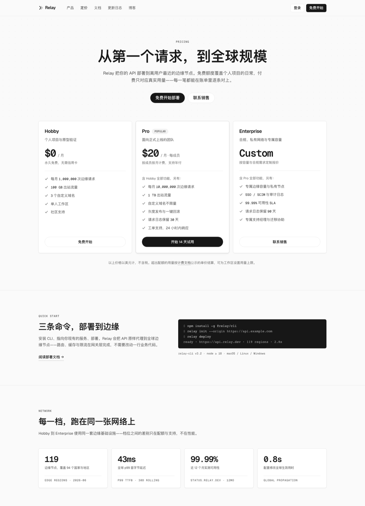
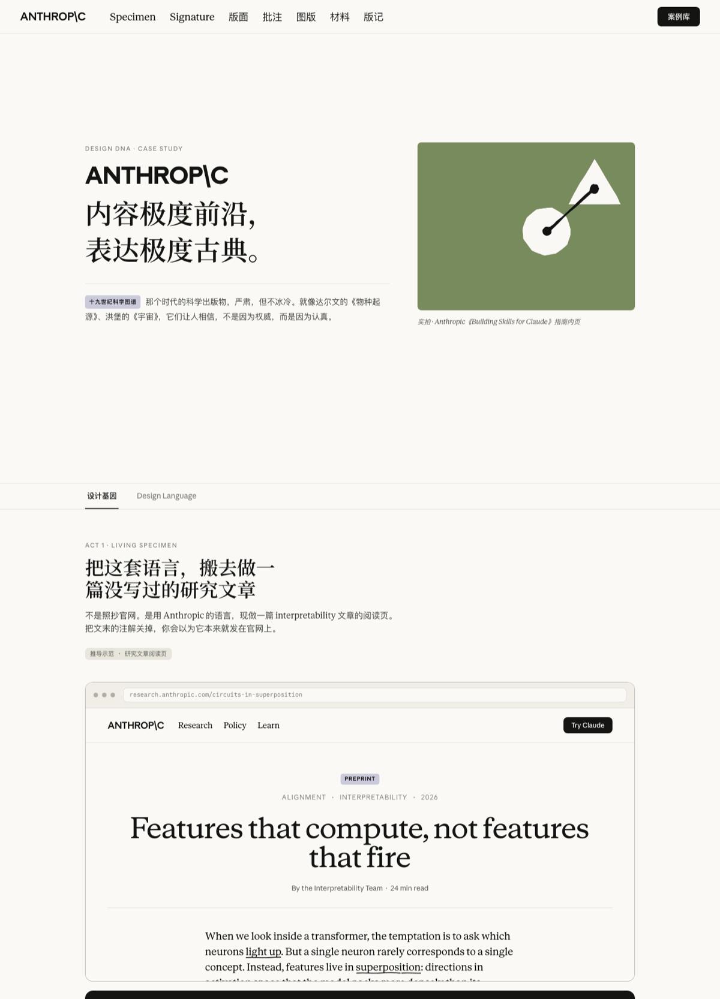

<div align="center">

# Design Sense

**把品牌的视觉哲学，蒸馏成 AI 可学习的 skill。**

by 布灵布灵灵 · [小红书](https://xhslink.com/m/1ht5s0trmNo) · [English](./README.en.md)

MIT · Claude Code skill · 装上即用

</div>

---

## 解决什么问题

设计审美不是玄学。

AI 能照着参数做，但常常没有品味。它知道品牌色的色值，不知道用量。规范没写到的地方，它掉回平庸的 SaaS 模板。

缺的不只是参数，缺的是参数背后的判断：什么该用，用多少，没写到的地方怎么推。
Design Sense 给 AI 的不只是色值、字体、token，它给的是参数之上的判断。

好的设计语言不只告诉 AI 一个产品长什么样，还要教会它这个产品怎么想。

---

## 人和 AI 各做一半

这个项目由作者和 AI 一起完成。扒参数的是 AI：12 个维度的逆向实测，每个值可回溯；判断「是什么打造了这个感觉」的是人：什么是灵魂、什么只是表皮，什么写进规则、什么留给 AI 发挥。

AI 时代，品味是人留在系统里的那部分。

---

## 先看成品

左页由**没有任何上下文的 agent 只读 skill 文件从零做出**——没有参考截图，没有人工修改；右页是 Anthropic 解析案例页，用这门语言排版它自己。

<table>
<tr>
<td width="50%"></td>
<td width="50%"></td>
</tr>
<tr>
<td align="center"><b>dna-vercel</b> · 工程克制</td>
<td align="center"><b>dna-anthropic</b> · 复古编辑</td>
</tr>
</table>

判定标准从来不是「复制了多少参数」，是「**看起来像不像它在做**」——用这套语言做你自己的东西，而不是抄一遍参照品牌。

**想要可靠的复古感，传达可被信任的感觉，用 anthropic；想传达严谨克制的工程感，用 vercel。**

更多口味在训练中：锋利暗色、产品戏剧、大胆渐变。

---

## 覆盖

|   | 领域 | 参照品牌 | 气质 | 状态 |
|---|------|----------|------|------|
| ✓ | 开发者基础设施 | **Vercel** | 工程克制 · Engineered Restraint | v1.3 · 2026-07 |
| ✓ | AI 实验室 | **Anthropic** | 复古编辑 · Vintage Editorial | v1.2 · 2026-07 |
| ○ | 开发者工作台 | Linear | — | 训练中 |
| ○ | 金融支付 | Stripe | — | 训练中 |
| ○ | 高端消费 | Apple | — | 训练中 |
| ○ | B2B SaaS | Intercom | — | 训练中 |

---

## 安装与使用

每个出厂的品牌都是标准的 [Claude Code](https://claude.com/claude-code) skill——五个文件，自包含：

```bash
git clone https://github.com/pxx-design/design-sense.git

# 用户级（所有项目可用）
cp -r design-sense/skills/dna-vercel ~/.claude/skills/
cp -r design-sense/skills/dna-anthropic ~/.claude/skills/
```

然后对 Claude 说：

> 「请使用 dna-vercel skill，给我做一个定价页。」
>
> 「请使用 dna-anthropic skill，给我做一个研究索引页。」

完整中文指南（安装细节、提示词模板、两套 skill 的选用对照、常见问题）：[dna-vercel 使用说明](docs/dna-vercel-usage.zh.md) · [dna-anthropic 使用说明](docs/dna-anthropic-usage.zh.md)

---

## 一个 skill 的构造

五个文件，五个海拔：

| 文件 | 海拔 | 装什么 |
|------|------|--------|
| `SKILL.md` | 判断 | 先及格再风格（通用排版七问 + 咬合纪律）、红线先行、协商机制、出厂自检清单、中文适配 |
| `reasoning.md` | 语言 | 文化根、反直觉决策、新场景怎么推 |
| `layouts.md` | 参数 | 分载体规格——每个值标明实测还是推导 |
| `tokens.css` | 实现 | 直接引用的 CSS 变量和基础组件 |
| `specimen.md` | 校准 | 品牌原站现场带批注——「好的分配」长什么样，逐条挂实测值 |


---

## 方法论

每个品牌的训练分四层，判断浓度逐层升高：

**1 · 证据，机器扒。** 对照品牌原站做 12 个维度的逆向实测 -- 从色彩系统、排版到动效语言，包括"刻意不存在的东西"。这一层详尽，但还不是哲学。

**2 · 推理，设计师判断。** 读证据，写出这个品牌真实的想法：文化根在哪、凭什么与众不同、每个参数为什么取这个值、它拒绝做什么。机器止步于此，判断从这里开始。

**3 · 洞察，随品牌走。** 一个品牌承载几个洞察由品牌自己决定，不套模板。每个洞察可以把多个维度融成一个观察。

**4 · 冷跑验收。** skill 出厂前，一个没有任何上下文的 agent 只读skill，从零做一个完整页面并通过 skill 自己的出厂清单。一致性交给机器测，品味由人眼定。

---

## 边界

Design Sense 管的是**品牌级视觉语言**——页面该长什么样、传达什么感觉。通用界面工艺（无障碍、表单、性能）不在此列。

---

## License 与声明

代码与 skill 文本 MIT。真身字体均为各品牌专有，skill 使用官方替身并明示出处。

本项目为独立作品，与 Vercel、Anthropic 及表中所列品牌均无隶属或背书关系；skill 内容来自对公开网页的独立观察，品牌名与商标归各自所有者。

## 作者

shona（布灵布灵灵）· 2026
